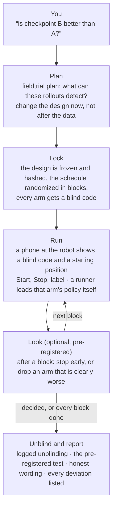
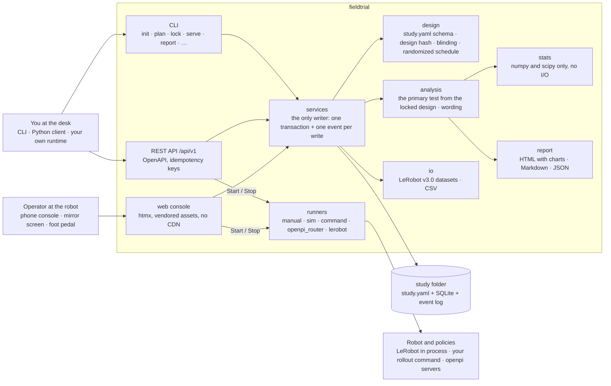

<h1 align="center">fieldtrial</h1>

<p align="center"><strong>Find out whether your robot policy actually got better.</strong><br>
<sub>fieldtrial is named after the agricultural field trials where Ronald Fisher worked out randomization and randomized blocks at Rothamsted in the 1920s. A robot evaluation is the same problem a century later: a noisy outcome, a few dozen plots of ground (here, starting positions on a table), and a strong temptation to see the result you were hoping for.</sub></p>

<p align="center">Plan how many rollouts you need, run them randomized and blinded from a phone at the robot, let the policy switch itself so nobody knows which arm is running, and get a report that says "better" only when a test you chose before the first trial says so.</p>

<p align="center">
  <a href="https://github.com/rokbenko/fieldtrial/actions/workflows/ci.yml"></a>
  <a href="https://rokbenko.github.io/fieldtrial/"></a>
  <a href="https://pypi.org/project/fieldtrial/"></a>
  <a href="https://pypi.org/project/fieldtrial/"></a>
  <a href="https://github.com/rokbenko/fieldtrial/blob/main/LICENSE"></a>
  <a href="https://rokbenko.github.io/fieldtrial/guides/lerobot/"></a>
  <a href="https://rokbenko.github.io/fieldtrial/stats/"></a>
</p>

<details>
<summary>Hey, my name is Rok and this is why I built fieldtrial 👋</summary>

> Training a robot policy got easy. Knowing whether it got better did not.
>
> In 2026 you can fine-tune a vision-language-action model over a weekend. LeRobot gives you the data pipeline, pi0.5 or SmolVLA give you a strong starting point, and an arm that costs a few hundred dollars gives you a robot on your desk. Then you want to know if the new checkpoint is better than the old one, and everything falls apart.
>
> Here is what that usually looks like. You run each checkpoint twenty times. The new one succeeds 17 times, the old one 14. You post "+15 points!". I ran exactly those numbers through fieldtrial: the 95% interval for the difference goes from −11 to +39 percentage points. The new checkpoint could be a lot better, or worse. Twenty rollouts cannot tell, and nothing in the usual workflow tells you that they cannot.
>
> And the numbers are only half of it. The person running the rollouts knows which checkpoint is loaded. They reset the scene a little more carefully for the one they believe in. A wobbly insertion becomes a success for that one and a failure for the other. They run "a few more" when the result is close and stop when it looks good. Nobody is lying. People are just people, and every field that tests things in the real world learned this the hard way. Medicine answered it with randomized, blinded, pre-registered trials. Agriculture answered it a century ago, when Fisher started randomizing plots in blocks, which is where this project's name comes from.
>
> Then I read Dream Machines' write-up of their pi0.5 fine-tuning experiments, one of the most detailed public evaluations I know, with every count published. I re-ran their numbers. 13 of their 30 comparisons hold up. The other 17 could be noise. That is not their fault. The tools to plan, randomize, blind and analyse a robot evaluation properly simply did not exist in one place.
>
> So fieldtrial brings the field trial to the robot lab. It tells you how many rollouts you need before you start. It randomizes the order and hides which arm is which behind a blind code. It puts a console on the phone of whoever stands at the robot, switches the policy itself so they never have to know, and at the end writes a report that only says "better" when the test you chose before the first trial agrees.
>
> If robots are going to leave the lab, we need to know when they actually got better. That is why I built fieldtrial.
>
> — Rok Benko, October 2026

</details>

<p align="center">
  
  <br>
  <sub><strong>Blinded at the robot, honest at the desk.</strong> <code>fieldtrial demo</code> on 2026-10-02, recorded in a real browser with Playwright and sped up about two times. The robot is simulated, and its two arms truly succeed 76% and 90% of the time. On the left the operator only ever sees blind codes, presses Start and Stop, and labels the furthest stage reached; on the right a second screen mirrors the console and then, after every scheduled trial, unblinds (which is logged) and opens the report. The observed rates came out 33/40 against 34/40, and the report says the study could not tell the arms apart and what it could have detected, instead of crowning a winner. How every image here was made is in <a href="https://github.com/rokbenko/fieldtrial/blob/main/docs/assets/README.md">docs/assets</a>.</sub>
</p>

**fieldtrial** is an open source Python framework for statistically rigorous, real-world evaluation of robot policies. A study is one folder: a `study.yaml` that says which arms you compare (checkpoints, serving settings, whole policies), on which starting conditions, with what pass criteria and which pre-registered test, and a SQLite database that records every trial. `fieldtrial plan` tells you what the study can detect before you run it, `fieldtrial lock` freezes and hashes the design and randomizes the schedule, `fieldtrial serve --lan` puts a console on a phone at the robot, and `fieldtrial report` writes a self-contained HTML report whose primary analysis follows from the locked design, not from the data. In between, a runner switches the policy itself, so the operator never learns which arm is running: LeRobot policies run inside fieldtrial, or fieldtrial launches your own rollout command, or it routes an openpi client to one policy server per arm. Everything is local, works offline, and sends no telemetry.

It complements [LeRobot](https://github.com/huggingface/lerobot) and [openpi](https://github.com/Physical-Intelligence/openpi) and never forks them: they train and run the policy, fieldtrial decides what to run in which order and whether the result means anything. It is not a training framework, a simulation benchmark, a robot driver or a cloud service.

**Honest status: no study in this repository has been run on a real robot yet.** Every recording and number on this page comes from the simulated robot that ships with fieldtrial, from published counts (the Dream Machines re-analysis below), or from LeRobot 0.6.1 itself driving a simulated robot on a CPU. The statistics are the most tested part: every function is checked against an independent reference implementation. The console, the REST API and the runners are tested end to end against simulated robots, fake policy servers and a fake LeRobot. [Status](#status) says exactly how far each piece has got, and the first study on real hardware is the next milestone.

**No robot? You do not need one to try it.** `uvx fieldtrial demo` opens the study from the recording above, half run, with a simulated robot that suggests each outcome, and `uvx fieldtrial compare 17/20 14/20` answers the question this page opened with in one line ([Try it in 60 seconds](#no-robot-yet-try-it-in-60-seconds)).

<br>

## Table of Contents

- [Quickstart: compare two LeRobot checkpoints](#quickstart-compare-two-lerobot-checkpoints)
- [No robot yet? Try it in 60 seconds](#no-robot-yet-try-it-in-60-seconds)
- [Why?](#why)
- [How it works (the simple version)](#how-it-works-the-simple-version)
- [Example: 30 published comparisons, re-analysed](#example-30-published-comparisons-re-analysed)
- [Designs](#designs)
- [Status](#status)
- [Architecture](#architecture)
- [Installation](#installation)
- [Usage](#usage)
  * [The study file](#the-study-file)
  * [The console](#the-console)
  * [Runners: real blinding](#runners-real-blinding)
  * [Reward models as suggestions](#reward-models-as-suggestions)
  * [From code: the REST API and the stats library](#from-code-the-rest-api-and-the-stats-library)
- [The statistics](#the-statistics)
- [Limitations](#limitations)
- [Roadmap](#roadmap)
- [Contributing](#contributing)
- [How to cite](#how-to-cite)
- [Acknowledgements](#acknowledgements)
- [Star history](#star-history)
- [License](#license)

<br>

## Quickstart: compare two LeRobot checkpoints

Two arms, the same task, 40 starting positions each, a phone at the robot, and fieldtrial loading each checkpoint itself so whoever runs the trials never knows which one is on. You need Python 3.12 or newer for this path, because LeRobot itself does, and a robot LeRobot can drive.

1. **Install fieldtrial with the in-process LeRobot runner.**

    ```bash
    uv venv --python 3.12
    uv pip install "fieldtrial[lerobot-runner]"
    ```

2. **Create a study.** `init` writes a `study.yaml` with every option commented.

    ```bash
    fieldtrial init cup-study
    ```

3. **Describe the two arms and the robot.** Each arm names its checkpoint and how to serve it, and the robot is LeRobot's own robot configuration, as you would pass it to `lerobot-rollout --robot.*`.

    ```yaml
    arms:
      - id: baseline
        runner: lerobot
        policy: {path: outputs/pi05_21h/checkpoints/050000/pretrained_model}
        serving: {inference: {type: rtc, queue_threshold: 30}}
      - id: q50
        runner: lerobot
        policy: {path: outputs/pi05_21h/checkpoints/050000/pretrained_model}
        serving: {inference: {type: rtc, queue_threshold: 50}}

    runners:
      lerobot:
        robot:
          type: so101_follower
          port: /dev/ttyACM0
          id: lab_arm
          cameras:
            top: {type: opencv, index_or_path: 0, width: 640, height: 480, fps: 30}
        fps: 30
        keep_loaded: all          # both arms share one checkpoint, so it loads once
    ```

4. **Ask what the study can detect, before a single rollout.**

    ```console
    $ fieldtrial plan cup-study --baseline 0.7
    RTC queue threshold on the 21h pi0.5 checkpoint  design aea5f042c978
    40 conditions × 1 replicate(s); 80 trials: baseline 40, q50 40
    From a 70.0% baseline, 80% power at α = 0.05 for changes of at least +23.8 pp / −30.7 pp
    (independent-samples formula; paired designs usually do better).
    ```

    If you care about differences smaller than 24 points, add starting positions now, not after you have seen the data.

5. **Lock it.** The design is frozen and hashed, the schedule randomized in blocks (every starting position runs both arms, in random order), and each arm gets a blind code.

    ```bash
    fieldtrial lock cup-study
    ```

6. **Check the runner without touching the robot.** It checks that LeRobot is installed in a supported version and that every arm's policy configuration can be read, and names arms by blind code only.

    ```bash
    fieldtrial check-runners cup-study
    ```

7. **Serve the console and scan the QR code with a phone.** For every trial the phone shows a blind code and the starting position. Reset the scene, press Start, and fieldtrial loads that arm's policy (the first time), drives the robot and records the trial as one episode of a LeRobot dataset. Press Stop, label the furthest stage reached and why it ended. The robot returns to its starting pose, and the next blind code appears.

    ```bash
    fieldtrial serve cup-study --lan
    ```

8. **Unblind and read the report.** Unblinding is logged, and an early unblinding is flagged in the report.

    ```bash
    fieldtrial unblind cup-study
    fieldtrial report cup-study          # cup-study/reports/report.html
    ```

Every trial is linked to its dataset episode automatically, with its trial id in `fieldtrial_episodes.json` next to the dataset, so you can score the episodes with a reward model or train on the successful ones afterwards. The episode's task is the study's instruction, the same for every arm, so nothing in the dataset tells the arms apart.

**Not on LeRobot, or not on Python 3.12?** The `command` runner launches any rollout command you already have (`lerobot-rollout`, your own script) for each arm, and the `openpi_router` runner sits between an openpi client and one policy server per arm. Both work on Python 3.11 ([Runners](#runners-real-blinding)). Or run the robot however you like and only use fieldtrial to schedule and record: that is the `manual` runner, and it is the default.

**What has and has not happened on this path.** The in-process LeRobot runner was run on 2026-10-02 against LeRobot 0.6.1 itself, with a simulated arm and two small ACT checkpoints on a CPU, through the same REST API the phone uses: four trials, four episodes, four automatic links, and the report's runner table below. It has not driven a real robot, used a GPU, or run RTC inference on a policy that supports it.

| Arm | Trials | Policy loads | Median load (s) | Median recording rate (Hz) | Overruns | Control-loop errors |
|---|---|---|---|---|---|---|
| baseline | 2 | 1 | 0.6 | 10.0 | 0 | 0 |
| q50 | 2 | 2 | 0.7 | 10.0 | 0 | 0 |

<br>

## No robot yet? Try it in 60 seconds

```console
$ uvx fieldtrial compare 17/20 14/20          # the post that says "+15 points!"
Arm 1: 17/20 = 85.0% (95% CI 64.0%–94.8%)
Arm 2: 14/20 = 70.0% (95% CI 48.1%–85.5%)
Difference +15.0 pp, Newcombe 95% CI [−11.1 pp, +39.0 pp]
Boschloo p = 0.2871 (two-sided); does not reject H0 at α = 0.05
Fisher p = 0.4506

$ uvx fieldtrial power --p1 0.70 --p2 0.85    # what showing that +15 points would take
121 per arm (pooled-z)
Detects 0.7 → 0.85 (+15.0 pp) with 80% power, α = 0.05 (two-sided); exact n1 = 120.47

$ uvx fieldtrial demo                         # the study from the recording, in your browser
```

`fieldtrial demo` creates a blinded two-arm study whose arms truly succeed 76% and 90% of the time, runs half of it, and opens the console. Run the rest from the keyboard (Space starts and stops, Enter confirms the label the simulated robot suggests), unblind on the report page, and see whether 40 trials per arm found the 14-point difference. In the recording above they did not, and the report says so. Needs [`uv`](https://docs.astral.sh/uv/) and nothing else.

<p align="center">
  
  
  <br>
  <sub>The console on a phone, from <code>fieldtrial demo</code>. <b>Left:</b> a trial running, with nothing on screen that says which arm it is. <b>Right:</b> labelling it: the furthest stage reached (the simulated robot's suggestion is preselected, and you still confirm it), why it ended, and what went wrong.</sub>
</p>

<br>

## Why?

Real-world evaluation is slow, noisy and ad hoc, and the noise is much larger than intuition says. Forty rollouts at an observed 80% success rate leave the true rate anywhere between 65% and 90%. A real 10-point improvement from a 75% baseline needs about 250 rollouts per arm to show up reliably. Most fine-tuning comparisons you read run 20 to 50.

<p align="center">
  
  <br>
  <sub>Computed with <code>fieldtrial.stats</code> (Wilson intervals; pooled-z sample sizes, two-sided α = 0.05). A paired design, both arms on the same starting positions in randomized blocks, usually needs fewer rollouts than the independent-samples numbers on the right.</sub>
</p>

And the numbers are only half of the problem. The other half is people:

```
What usually happens:   run A twenty times, run B twenty times, B looks better, ship B
What a field trial is:  decide the test and the size first, randomize the order in blocks,
                        hide which arm runs, label every trial the same way, report what the
                        pre-registered test says, including "we cannot tell yet"
```

Whoever runs the rollouts usually knows which checkpoint is loaded, so the scene gets reset a little more carefully for the favourite and borderline outcomes drift its way. Runs happen in sessions, so lighting, gripper wear and the operator's patience change between arms. The test gets picked after the data is in, and the study stops when the result looks good. Each of those is small and none of them is dishonest, and together they are how most apparent improvements are made. fieldtrial removes them one by one: blind codes and a runner that switches the policy itself, randomized blocks so drift hits every arm alike, a design that is locked and hashed before the first trial, a rubric that labels every trial the same way, and report wording that is only allowed to say "better" when the pre-registered test rejects.

<br>

## How it works (the simple version)



| Step | Command | What it guards against |
|---|---|---|
| Plan | `fieldtrial plan` | running a study too small to answer the question, and finding out afterwards |
| Lock | `fieldtrial lock` | choosing the test, the pass criteria or the sample size after seeing the data. Later edits are allowed, as logged amendments that the report lists |
| Randomize | (part of `lock`) | drift between sessions masquerading as an effect: each block runs every arm on the same starting position, in random order |
| Blind | blind codes, runners | the operator treating the favourite differently, consciously or not |
| Label | the console's rubric | a different bar for "success" on different trials: every trial is labelled by its furthest stage, why it ended, and failure tags |
| Look | automatic after each block | peeking: only the pre-registered rule (group-sequential, anytime-valid or best-arm selection) may stop a study or drop an arm |
| Report | `fieldtrial report` | "B is better" without a test: report text goes through one wording module that cannot say it unless the primary test rejected |

Every write is one transaction with one row in an append-only event log, so a study can always say who did what and when. Even an undo is an event.

<br>

## Example: 30 published comparisons, re-analysed

In September 2026 Dream Machines published a detailed write-up of their pi0.5 fine-tuning experiments (LoRA against full fine-tuning, learning rates, data quantity and quality, operators, interventions and a serving sweep), with every success count. It is one of the most complete public robot evaluations there is, which is exactly why it is worth re-reading with the right statistics. [examples/dream-machines-pi05](https://github.com/rokbenko/fieldtrial/tree/main/examples/dream-machines-pi05) does that with fieldtrial: Boschloo's exact test and a Newcombe interval for each comparison, Holm's adjustment within each experiment.

<p align="center">
  
  <br>
  <sub>Every comparison in the re-analysis (<code>docs/assets/make_readme_charts.py</code>). Filled: resolved after Holm's adjustment within its experiment. Hollow: the data cannot tell the arms apart, which is not the same as the arms being equal. Some hollow intervals just miss zero; they did not survive the adjustment for the other comparisons in their experiment. The arms were evaluated in separate sessions, not one randomized study, so even the filled ones are an upper bound on what the data can show.</sub>
</p>

The serving sweep is the clearest case for designing the evaluation first. Eight settings were compared against the default, mostly at 40 trials each:

| Setting | Success | vs default (91/120 = 75.8%) | Holm p | Verdict |
|---|---|---|---|---|
| `R50_B20` | 74/80 = 92.5% | +16.7 pp (+6.2 to +26.0) | 0.016 | **resolved: higher** |
| `R50_B16` | 35/40 = 87.5% | +11.7 pp (−3.5 to +22.6) | 0.50 | not resolved |
| `R50_B25` | 68/80 = 85.0% | +9.2 pp (−2.4 to +19.6) | 0.50 | not resolved |
| `R50_B1` | 32/40 = 80.0% | +4.2 pp (−12.1 to +16.8) | 1.0 | not resolved |
| `R50_B25_compiled` | 29/40 = 72.5% | −3.3 pp (−20.1 to +10.8) | 1.0 | not resolved |
| `R50_B50` | 22/40 = 55.0% | −20.8 pp (−37.5 to −4.3) | 0.077 | not resolved |
| `sync_no_rtc` | 21/40 = 52.5% | −23.3 pp (−39.8 to −6.5) | 0.042 | **resolved: lower** |
| `R25_B50` | 20/40 = 50.0% | −25.8 pp (−42.1 to −8.8) | 0.021 | **resolved: lower** |

The report also says what it would take to settle the open questions, if the observed rates were the true ones: 172 trials per arm for `R50_B16`, 294 for `R50_B25`, and 41,908 for image augmentation, whose observed effect is −0.8 points. That last number is the useful answer: there is probably no difference worth looking for. A sweep like this one is what [best-arm selection](#designs) is for: it runs every surviving setting on the same starting positions block after block, and drops a setting as soon as another one beats it with confidence.

```bash
uv run python examples/dream-machines-pi05/reanalysis.py    # rewrites examples/dream-machines-pi05/REPORT.md
```

<br>

## Designs

The design you lock decides the primary analysis. Nothing is chosen after the data is in.

| Design | When | Primary analysis |
|---|---|---|
| Randomized blocks, 2 arms | Compare two checkpoints or settings on the same starting positions | Exact McNemar test with a Tango interval |
| Randomized blocks, 3+ arms | Several checkpoints at once | Cochran's Q, then pairwise McNemar with Holm |
| Replicates per condition | Several trials per starting position | Cochran–Mantel–Haenszel |
| Crossover rounds | The scene carries over between trials (a tray that fills up) | Period-adjusted crossover test of whole rounds |
| Checkpoint ladder | Does success grow with training step, and where does it level off? | Mantel trend test, fixed-sequence plateau test |
| Group-sequential stopping | A few planned interim looks, stop early on a clear result | Lan–DeMets error spending |
| Anytime-valid stopping | Check after every block, stop the moment the answer is clear | Betting confidence sequence on the paired differences |
| Best-arm selection | A sweep over serving settings: which one is best? | Successive elimination on pairwise confidence sequences |
| Single arm | Is one policy above a threshold? | Exact binomial test |

Every analysis also gets an independent-samples sensitivity analysis, stage funnels, time to success, drift checks across sessions, and a list of every deviation from the plan.

Group-sequential stopping, anytime-valid stopping and best-arm selection let a study end early without cheating. Two simulated studies, run with `fieldtrial simulate` and reported with `fieldtrial report`:

<p align="center">
  
  
  <br>
  <sub><b>Left, anytime-valid stopping:</b> two arms whose simulated true rates are 55% and 88%, 60 blocks planned. The study was checked after every block and stopped after 28, when the confidence sequence for the difference left zero behind: 24/28 against 14/28, +35.7 points, anytime-valid p = 0.046, with half the rollouts unused. <b>Right, best-arm selection:</b> four serving settings at 62%, 82%, 88% and 45%. The worst was dropped after block 30 and its remaining trials cancelled, but after all 90 blocks q70 (91%) still could not be separated from q50 (79%) and q30 (71%), and the report names no winner. Both are single simulations, picked to show what the charts look like, not how often they end this way: <a href="https://rokbenko.github.io/fieldtrial/stats/step-evaluation/">the docs</a> have the simulated power.</sub>
</p>

Stopping early is not free. Over 400 simulated studies per row, at most 100 paired blocks, two-sided α = 0.05 (the first row has no difference, so its power is the false positive rate):

| Control | Treatment | Anytime-valid: power | Mean blocks | Group-sequential (5 looks): power | Mean blocks | Fixed, 100 blocks: power |
|---|---|---|---|---|---|---|
| 0.60 | 0.60 | 0.04 | 98 | 0.06 | 99 | 0.04 |
| 0.60 | 0.75 | 0.30 | 86 | 0.55 | 90 | 0.52 |
| 0.60 | 0.90 | 0.99 | 40 | 1.00 | 58 | 1.00 |
| 0.40 | 0.90 | 1.00 | 20 | 1.00 | 42 | 1.00 |

Anytime-valid checking pays for its freedom with power when the effect is small, and wins big when it is large. That is the trade-off the study file makes you choose before the first trial.

<br>

## Status

Version 0.3 on `main` (0.2.0 on PyPI): the statistics, every design above, the console, the REST API, three runners that switch policies, an evaluation camera, LeRobot dataset links and reward models. How far each piece has actually been exercised:

| Piece | Status |
|---|---|
| Statistics core (`fieldtrial.stats`, numpy and scipy only) | ✅ every function checked against an independent reference (statsmodels, scipy, R's `ldbounds`, MIT `confseq`, `ppi-python`, closed forms or brute-force enumeration) and by property tests, including nightly slow tests of coverage and type I error |
| Designs: blocks, crossover rounds, ladders, interim looks, anytime-valid stopping, best-arm selection, locking and amendments | ✅ end to end on the simulated robot; the design hashes of studies written for 0.1 and 0.2 are pinned in tests |
| Operator console, live mirror, keyboard and foot-pedal keys, LAN with a QR code | ✅ tested through the app in process, and driven in a real Chromium for the recordings on this page. Never yet at a real robot |
| REST API (`/api/v1`) and the dependency-free Python client | ✅ tested end to end, with an OpenAPI schema |
| Reports: HTML with charts, Markdown, versioned JSON results | ✅ the JSON schema is published and checked for drift on every push |
| `command` runner | ✅ real processes in tests, with process groups and signal escalation on Linux and macOS. Not yet with `lerobot-rollout` on a robot |
| `openpi_router` runner | ✅ real websockets against fake openpi-style policy servers, including the metadata check. Not yet with openpi's own servers |
| `lerobot` runner (in-process, Python 3.12+) | 🧪 tested against a fake LeRobot with 0.6.1's signatures, and run once against LeRobot 0.6.1 itself (simulated arm, small ACT checkpoints, CPU, through the REST API). No real robot, no GPU, no RTC policy |
| Evaluation camera and rig checks | 🧪 tested with synthetic frames and a fake camera. Never a real camera |
| LeRobot dataset links | ✅ against v3.0 datasets written in tests and one recorded by LeRobot 0.6.1 itself |
| Reward models (Robometer, TOPReward), blind review, Cohen's κ, PPI++ | 🧪 the statistics match statsmodels and ppi-python; the scorers are written against LeRobot 0.6.1's source and tested with a fake scorer, never with real weights |
| A study on real hardware | ⏳ none yet, and the next milestone |

CI runs the fast tests, ruff, mypy in strict mode and the import contracts on Python 3.11, 3.12 and 3.13, on Linux and macOS, on every push, and the slow statistical tests nightly.

<br>

## Architecture

One rule shapes the whole package: the statistics know nothing about studies, and only one layer touches the database. `fieldtrial.stats` is pure numpy and scipy, with no I/O and no imports from the rest of fieldtrial, so it can be tested against reference implementations in isolation and used on its own. The CLI, the console and the REST API all go through `fieldtrial.services`, which is the only code that writes, and every write is one transaction plus one row in an append-only event log. Import contracts enforce both rules on every push.



**State lives in events.** A trial's label, an undo, an amendment, an interim look, a runner's measurements, a link to a dataset episode, a reward-model score: each is one event, and later versions add event kinds instead of database migrations. Unblinding is an event too, so a report can flag an early one.

**Blinding is structural, not a promise.** While a study is blinded the console, the API, `fieldtrial status` and every export name arms by blind code only. A runner passes on only the blind code and the arm's settings to the processes, servers and datasets it touches, never the arm's name, and the `lerobot` runner keeps checkpoint paths out of every message the operator can see.

**Randomness is reproducible.** Every random draw, the schedule, the blind codes, a review sample, comes from the study's seed through raw PCG64 output, never from numpy `Generator` methods whose streams can change between numpy versions, so a locked study reproduces its schedule on any machine.

**Wording is code.** Report sentences come from one module that is not allowed to call an arm better unless the pre-registered test rejected, and that says what the study could have detected when it did not.

The full plan, with the reasoning behind every decision, is [docs/PLAN.md](https://github.com/rokbenko/fieldtrial/blob/main/docs/PLAN.md), and its decision log records each change of course.

<br>

## Installation

Requirements: Python 3.11 or newer, Windows, macOS or Linux. No GPU, no network and no account. The core is the statistics, the study tools, the console and the reports.

```bash
uvx fieldtrial --version                           # try it without installing
uv tool install fieldtrial                         # or: pip install fieldtrial
uv pip install "fieldtrial[lerobot-runner]"        # the in-process LeRobot runner (Python 3.12+)
```

| Extra | Adds | Python |
|---|---|---|
| *(none)* | statistics, studies, console, REST API, reports, the `manual`, `sim` and `command` runners | 3.11+ |
| `openpi` | the `openpi_router` runner (websockets) | 3.11+ |
| `capture` | the evaluation camera and rig checks from the camera (OpenCV, PyAV) | 3.11+ |
| `lerobot` | reading LeRobot v3.0 datasets to link trials to episodes (pyarrow) | 3.11+ |
| `lerobot-runner` | the in-process `lerobot` runner (LeRobot 0.6 with its dataset tools, and torch) | 3.12+ |
| `rewards` | Robometer and TOPReward reward models (LeRobot 0.6, torch, transformers) | 3.12+ |
| `docs` | building this documentation | 3.11+ |

LeRobot, torch and openpi are never imported until a study asks for them, so the core stays small and starts fast. The `lerobot-runner` and `rewards` extras need Python 3.12 because LeRobot does: on 3.11 they resolve to nothing.

<br>

## Usage

```bash
fieldtrial ci 32/40                           # an interval for one success rate
fieldtrial compare 74/80 91/120               # two independent arms
fieldtrial paired --b 11 --c 2 --n 28         # two arms on the same conditions (discordant pairs)
fieldtrial power --p1 0.76 --p2 0.90          # rollouts per arm
fieldtrial mde --p1 0.7 --n 40                # what 40 rollouts per arm can detect
fieldtrial adjust 0.01 0.04 0.03 --method holm

fieldtrial init my-study --template best-arm  # basic, best-arm, checkpoint-ladder, crossover-rounds, serving-sweep
fieldtrial validate my-study                  # every problem, with its line
fieldtrial plan my-study --baseline 0.75
fieldtrial lock my-study
fieldtrial serve my-study --lan               # or a folder of studies
fieldtrial status my-study                    # blinded: no per-arm results
fieldtrial unblind my-study
fieldtrial report my-study --format html      # or md, json
```

| Group | Commands |
|---|---|
| Calculators | `ci` `compare` `paired` `power` `mde` `adjust` |
| Study | `init` `validate` `plan` `lock` `amend` `status` `unblind` `analyze` `report` |
| Running | `serve` `demo` `simulate` `interim` `check-runners` `rig-check` |
| Data | `import` `export` `link-episodes` `score-episodes` `review-sample` `import-proxy` |

The full reference is [docs/cli.md](https://rokbenko.github.io/fieldtrial/cli/).

### The study file

A study is one folder with a `study.yaml`, and everything that matters for the analysis is in it: the task and its rubric, the arms, the starting conditions, the design and the pre-registered analysis. Cosmetic fields (titles, labels, the instruction) can change after locking; anything else changes the design hash and needs a logged amendment.

```yaml
rubric:
  stages:                        # ordered; reaching stage k implies every earlier stage
    - {id: lift,     label: "Lifted the correct part"}
    - {id: handover, label: "Clean handover, held at least 1 s"}
    - {id: inserted, label: "Inserted, but tilted or misoriented"}
    - {id: clean,    label: "Clean insertion, correct orientation"}
  success: clean
  failure_tags: [dropped, missed_grasp, wrong_part, collision, stuck]

conditions:
  factors:
    slot: {range: [1, 40]}       # 40 starting positions, each runs every arm once

design:
  type: randomized_block
  blinding: operator
  seed: 20261001

analysis:
  primary:
    comparison: {treatment: q50, control: baseline}
    alpha: 0.05
  stopping: {rule: anytime}      # or fixed, or {rule: group_sequential, looks: 4}
```

Templates for each design come with `fieldtrial init --template`, and [docs/studies.md](https://rokbenko.github.io/fieldtrial/studies/) documents every field.

### The console

`fieldtrial serve` runs the console and the REST API, and `--lan` puts it on the local network behind a token, with a QR code in the terminal for the phone. A session starts with the rig checklist from the study file. For each trial the console shows the blind code, the starting condition and the instruction, a timer with the study's time limit, and the label form: the furthest stage reached, why the trial ended, failure tags and a note. A finished trial can be undone for ten seconds, an invalid trial (a robot fault, a bad reset) is voided with a reason and rescheduled at the end of its block, and a second screen can mirror the console live. Space and Enter work from a keyboard or a USB foot pedal, so the operator's hands stay free.

With `capture.camera` in the study file, an evaluation camera records every trial from Start to Stop and attaches the clip, and compares the rig with a reference photo every few trials to catch a moved camera, a changed light or a shifted fixture ([docs/console.md](https://rokbenko.github.io/fieldtrial/console/)).

### Runners: real blinding

With the default `manual` runner the operator loads each checkpoint, so they can know which arm runs. A switching runner starts the policy itself:

| Runner | For | What it does |
|---|---|---|
| `lerobot` | LeRobot policies (Python 3.12+) | Runs each arm's LeRobot policy inside fieldtrial on a robot connected once, shares weights between arms on one checkpoint, records each trial as a dataset episode and links it |
| `command` | Any policy you start with a command | Runs a command template per trial (or keeps one process per arm), filled with the arm's `policy` and `serving` values and the blind code, and stops it cleanly on Stop |
| `openpi_router` | openpi-style websocket policy servers | Sits between the robot's openpi client and one policy server per arm, and forwards each trial's frames to that trial's arm |

The console and the REST API both drive the runner: Start starts the arm, Stop stops it, and a runner that cannot start voids the trial with the reason. What each runner measures (request latency, exit codes, policy load times, the recording rate) goes into the report's Runner section ([Real blinding with runners](https://rokbenko.github.io/fieldtrial/guides/runners/)).

### Reward models as suggestions

Reward models can watch an episode and estimate whether the task was done. fieldtrial uses them three ways, and never in place of a person's label: **agreement** (Cohen's κ between the model's suggestions and the operators' labels, to see whether the model is worth using), **blind review** (a seeded random sample of extra episodes, overnight runs or DAgger rollouts, labelled in the console before the model's suggestion is shown), and **proxy-assisted estimates** (PPI++, which combines the model's scores on many episodes with the reviewed sample for a narrower interval, as a pre-registered secondary analysis). The primary analysis always uses the human labels of the scheduled trials ([Reward models](https://rokbenko.github.io/fieldtrial/guides/reward-models/)).

```bash
fieldtrial score-episodes my-study user/overnight_k7 --model robometer --arm K7
fieldtrial review-sample my-study user/overnight_k7 --n 40
```

### From code: the REST API and the stats library

A custom runtime (a ROS node, a game loop, a lab script) can drive a study over HTTP with the dependency-free client, the same calls the console makes ([Custom runtimes](https://rokbenko.github.io/fieldtrial/guides/custom-runtimes/)):

```python
from fieldtrial.client import Client

api = Client("http://127.0.0.1:8765", study="my-study")
session = api.start_session(operator="ros-node", rig="rig-1").session.session_id

while (slot := api.session(session).up_next) is not None:  # blind code and condition, never the arm
    load_arm(slot.blind_code)  # your code
    trial = api.start_trial(slot.slot_id, session)
    stage, reason = run_policy(slot.factors)  # your code: furthest stage, why it ended
    stopped = api.stop_trial(trial.trial_id, expected_version=trial.version)
    api.complete_trial(
        trial.trial_id, stage=stage, termination=reason, expected_version=stopped.version
    )
api.end_session(session)
```

And `fieldtrial.stats` works on its own, with frozen dataclasses for every result:

```python
from fieldtrial.stats import compare_paired, proportion_ci, sample_size

proportion_ci(32, 40)  # Wilson interval: 65.2% to 89.5%
compare_paired(b=11, c=2, n=28)  # exact McNemar with a Tango interval
sample_size(0.75, 0.85).n1  # 250 rollouts per arm
```

<br>

## The statistics

Every function is tested against an independent reference implementation, has a property test, and is documented with its formula and a reference in [the statistics reference](https://rokbenko.github.io/fieldtrial/stats/).

| Question | Method | Checked against |
|---|---|---|
| What is one arm's success rate? | Wilson (default), Clopper–Pearson, Jeffreys, Agresti–Coull intervals | statsmodels |
| Did arm 1 beat arm 2 in separate trials? | Newcombe interval, Boschloo exact test, Fisher | scipy, statsmodels |
| …on the same conditions? | Exact McNemar, Tango interval | published values, a numerical re-derivation |
| More than two arms? | Cochran's Q, pairwise McNemar, Holm | statsmodels |
| Several trials per condition? | Cochran–Mantel–Haenszel | statsmodels |
| Did results change between sessions? | Homogeneity tests | statsmodels |
| Does success grow with training step? | Cochran–Armitage and Mantel trend, plateau tests | statsmodels, enumeration |
| The scene carries over? | Two-period crossover of whole rounds, exact randomization test | scipy, enumeration |
| Can I stop early? | Lan–DeMets error spending | R `ldbounds` |
| Can I look after every block? | Betting confidence sequences (Waudby-Smith and Ramdas) | MIT `confseq`, exactly |
| Which of several settings is best? | Successive elimination on confidence sequences | MIT `confseq`, simulation |
| Does a reward model agree with people? | Cohen's κ (Fleiss–Cohen–Everitt interval) | statsmodels |
| Can reward-model scores tighten my interval? | Prediction-powered inference (PPI++) | ppi-python, to machine precision |
| How many rollouts do I need? | Sample size, power, minimum detectable effect, exact power | statsmodels, simulation |

Defaults are 95% intervals, two-sided tests and α = 0.05. Results that are not tests (Bayesian posterior probabilities, stage funnels, time-to-success curves) are labelled descriptive in every report.

<br>

## Limitations

- No study in this repository has run on a real robot. The console, the runners and the camera have been exercised against simulated robots, fake servers, a fake LeRobot and LeRobot 0.6.1 with a simulated arm, and the recordings on this page come from the simulated robot. What changes on a bench (how long a policy takes to load on a GPU, how operators use the phone, how often trials are voided) has not been measured.
- The `lerobot` runner mirrors LeRobot 0.6.1's set-up rather than calling it, because LeRobot's function loads one policy and connects the robot each time. It refuses other LeRobot versions, and does not support PEFT adapters, `torch.compile`, teleoperated resets or DAgger interventions. The first trial of each arm waits while its policy loads.
- The reward-model scorers have never run with real weights in fieldtrial's CI, which has no GPU. They use one score per episode (Robometer's last-frame progress, TOPReward's completion probability), and their calibration is not modelled.
- Proxy-assisted estimates describe the reviewed sample of extra episodes, not the scheduled trials, and use large-sample intervals.
- Anytime-valid stopping and best-arm selection support randomized blocks with one replicate per condition, and anytime-valid stopping two arms. A non-inferiority margin exists in the library but not yet in the study file.
- Best-arm selection only drops an arm on a pairwise confidence sequence, so close settings can run to the end without a winner, as in the chart above.
- The Dream Machines re-analysis treats arms as independent samples from separate sessions, as published. It can say which comparisons the counts support, not whether the sessions drifted.

**Non-goals, on purpose:** no training, no simulation benchmark, no robot drivers, no labeling platform, no cloud service and no telemetry. fieldtrial plans, schedules, records and analyses, and leaves the robot to the tools that already run it.

<br>

## Roadmap

- **Hardware:** a first study on a real SO-101 arm with the `lerobot` runner, recorded end to end, so the recording at the top of this page can be replaced by a real one.
- **v0.3 release:** M8 (anytime-valid comparisons and best-arm selection), M9 (reward models, blind review, κ and PPI++) and M10 (the in-process LeRobot runner) are on `main` and go to PyPI as 0.3.0.
- **Next:** a non-inferiority margin in the study file, an indifference zone for best-arm selection so close sweeps can end sooner, nonasymptotic proxy-assisted intervals, and preloading every arm's policy when a session opens.
- **Upstream:** a candidate proposal for LeRobot, a strategy registry in `lerobot.rollout` and a set-up that accepts an already connected robot, so tools like fieldtrial can reuse it instead of mirroring it.

The milestone plan and the limits of each milestone are in [docs/ROADMAP.md](https://github.com/rokbenko/fieldtrial/blob/main/docs/ROADMAP.md).

**Help wanted:** a study on your own robot, with any policy and any runner. A report from a real bench, including the trials that went wrong, is the most useful contribution this project can get right now.

<br>

## Contributing

Bug reports, studies from real benches and pull requests are welcome. Tests need no network, no keys and no robot:

```bash
git clone https://github.com/rokbenko/fieldtrial && cd fieldtrial
uv sync --extra openpi --extra capture --extra lerobot --extra docs
uv run pytest -m "not slow"
```

Any new or changed statistics function needs a golden test against an independent reference, a property test and a documentation entry with the formula and a reference. [CONTRIBUTING.md](https://github.com/rokbenko/fieldtrial/blob/main/CONTRIBUTING.md) has the rest, and [CLAUDE.md](https://github.com/rokbenko/fieldtrial/blob/main/CLAUDE.md) the architecture rules in brief.

<br>

## How to cite

If fieldtrial helps your research, please cite it ([CITATION.cff](https://github.com/rokbenko/fieldtrial/blob/main/CITATION.cff)):

```bibtex
@software{benko_fieldtrial,
  author  = {Benko, Rok},
  title   = {fieldtrial: statistically rigorous real-world evaluation for robot policies},
  url     = {https://github.com/rokbenko/fieldtrial},
  license = {Apache-2.0}
}
```

For evaluation practice in general, read Kress-Gazit et al. (2024), *Robot Learning as an Empirical Science: Best Practices for Policy Evaluation*, arXiv:2409.09491.

<br>

## Acknowledgements

fieldtrial stands on other people's work. Thanks to Hugging Face for [LeRobot](https://github.com/huggingface/lerobot), whose datasets, reward models and rollout engine fieldtrial builds on, and to Physical Intelligence for [openpi](https://github.com/Physical-Intelligence/openpi). The anytime-valid test follows Waudby-Smith and Ramdas and reproduces their [confseq](https://github.com/gostevehoward/confseq) package exactly; the proxy-assisted estimates follow Angelopoulos and colleagues' [ppi-python](https://github.com/aangelopoulos/ppi_py); and [statsmodels](https://www.statsmodels.org/) and [scipy](https://scipy.org/) are the references most of the statistics are checked against. Thanks to Dream Machines for publishing every count of their pi0.5 experiments, which made the re-analysis possible, and to Kress-Gazit and colleagues, whose best-practice paper is the checklist this project grew from.

fieldtrial is an independent project, not affiliated with or endorsed by Hugging Face, Physical Intelligence or Dream Machines.

<br>

## Star history

<p align="center">
  <a href="https://www.repostars.dev/?repos=rokbenko%2Ffieldtrial&theme=terminal">
    
  </a>
</p>

<br>

## License

[Apache 2.0](https://github.com/rokbenko/fieldtrial/blob/main/LICENSE).
