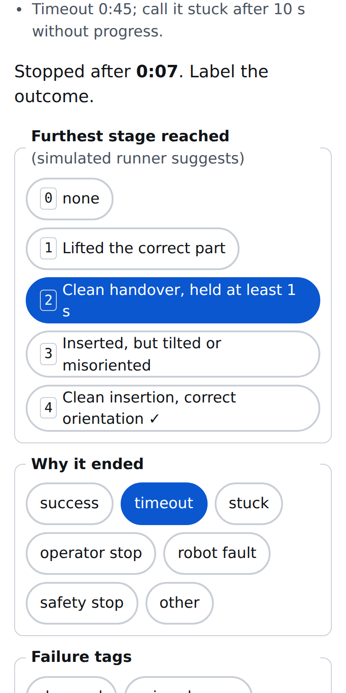
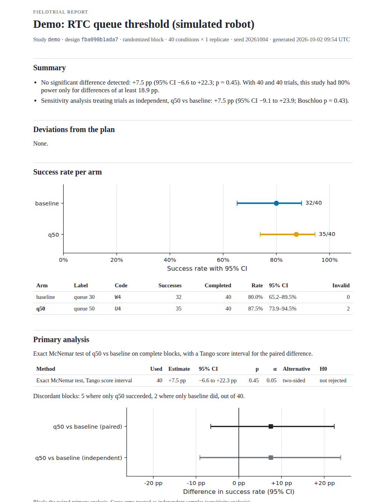

# fieldtrial

**Find out whether your robot policy actually got better.**

fieldtrial is an open-source Python framework for statistically rigorous, real-world
evaluation of robot policies. LeRobot trains the policy; fieldtrial tells you whether it
actually got better.

```console
$ uvx fieldtrial demo
```

[Quickstart](quickstart.md){ .md-button .md-button--primary }
[Concepts](concepts.md){ .md-button }

## What it does

- **Before an evaluation:** how many rollouts do you need? What is the smallest difference
  this evaluation can detect? See [How many rollouts do I need?](guides/how-many-rollouts.md)
- **During:** a randomized, blinded schedule, plus a phone-friendly
  [operator console](console.md) that records the outcome, the furthest stage reached and
  the failure mode of each rollout.
- **After:** the right statistics for the design (exact tests, paired designs, multiplicity
  control), honest wording, and a self-contained [report](analysis.md).

{ width="300" }
{ width="420" }

## Principles

- **Correctness first.** Every statistical function is tested against an independent
  reference implementation.
- **Pre-registration.** The design is locked and hashed before the first trial, and the
  primary test follows from it.
- **Honest language.** A report describes a difference only when the pre-registered test
  rejects; otherwise it says what the study could have detected.
- **Local-first.** One folder per study and SQLite storage. Works offline on a factory LAN.
- **No telemetry**, ever.

## Where next

- [Quickstart](quickstart.md): the demo, the calculator, your first study.
- [Concepts](concepts.md): arms, conditions and blocks, stages, blinding, invalid trials.
- [Guides](guides/how-many-rollouts.md): planning, comparing checkpoints, ladders, serving
  sweeps, LeRobot, openpi, custom runtimes.
- [Statistics reference](stats/index.md): every method with its formula and references.
- [Re-analysis of a published evaluation](https://github.com/rokbenko/fieldtrial/tree/main/examples/dream-machines-pi05).
